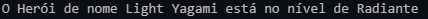

# Classificador Nível Herói

## :rocket: Descrição do projeto

É criado um herói com nome e quantidade de XP, depois o nível é classificado de acordo com a quantidade de XP. Projeto faz parte do desafio de código da [DIO](https://dio.me).

## :books: Tecnologias necessárias para executar

## :speech_balloon: Conheça mais dos meus projetos

Me adicione no Linkedin :point_right: [Leonardo Abdala](https://www.linkedin.com/in/leonardo-abdala/) e no Github, vamos desenvolver juntos. :facepunch:
